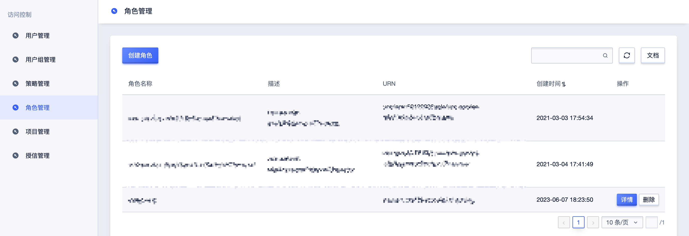
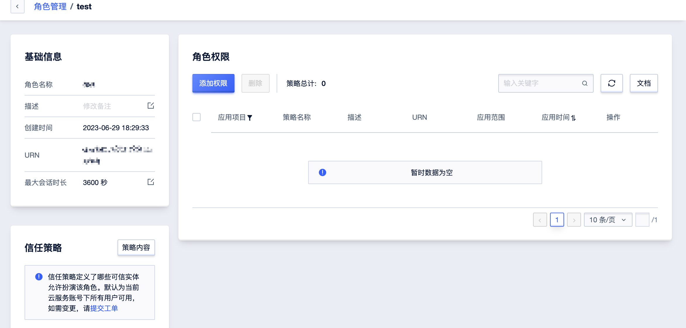

# 角色管理

角色与 用户一样，都是IAM身份类型的一种。IAM角色是一种虚拟用户，没有确定的身份认证密钥，需要被一个受信的实体用户扮演才能正常使用。

### 创建角色

### 为角色授权

### 使用角色
通过调用API扮演IAM角色
有权限的IAM用户可以使用其访问密钥调用AssumeRole API，以获取某个IAM角色的安全令牌（STS Token），从而使用安全令牌访问UCloud。具体详情参考[sts ](https://docs.ucloud.cn/uproject/sts)。

