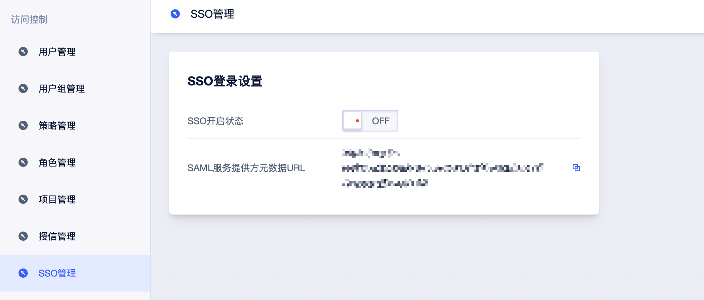
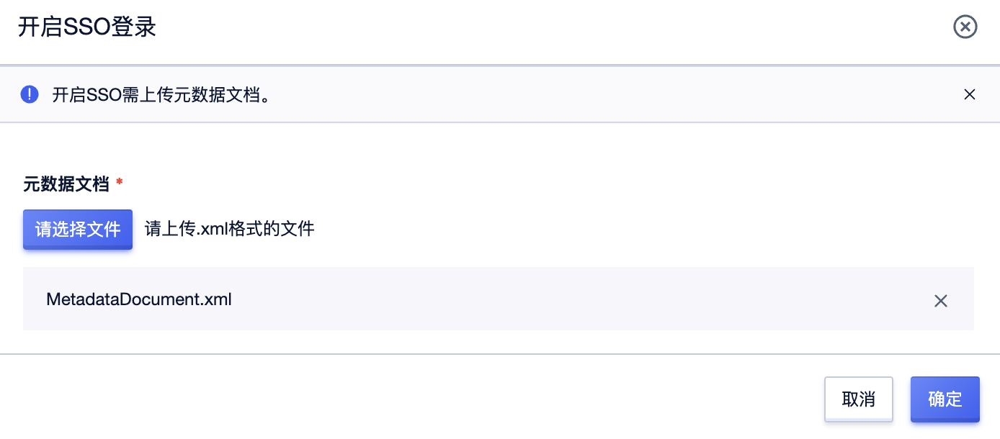
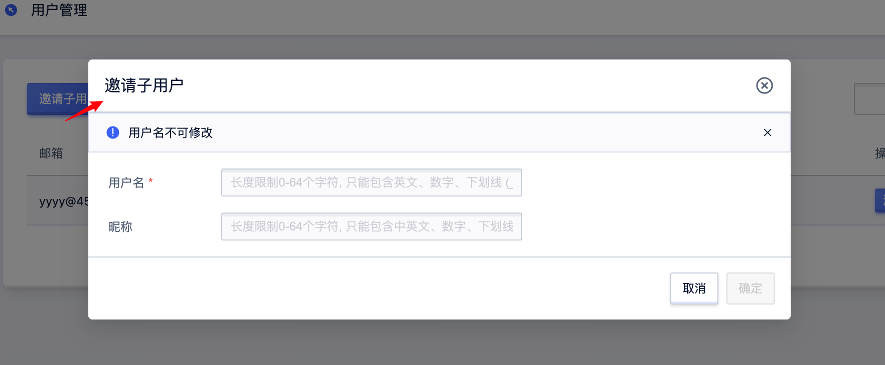
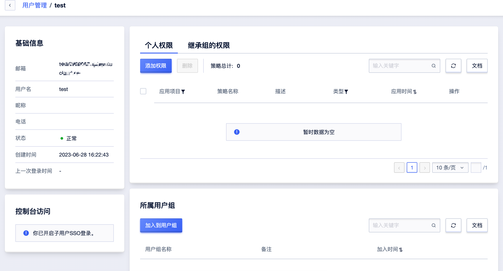
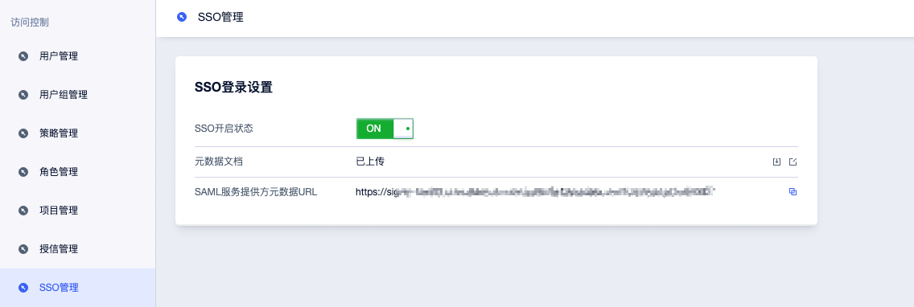

# SSO

支持基于 SAML 2.0 的 SSO（Single Sign On，单点登录），也称为身份联合登录。本文为您介绍企业如何使用自有的身份系统实现与 UCloud
的 SSO。

### 基本概念

* 身份提供商（IdP）：一个包含有关外部身份提供商元数据的 IAM 实体，身份提供商可以提供身份管理服务。
* 企业本地 IdP：Microsoft Active Directory Federation Service （AD FS）、Shibboleth 等。
* Cloud IdP：UCloud 应用身份服务、Azure AD、Google Workspace、Okta、OneLogin 等。
* 服务提供商（SP）：利用 IdP 的身份管理功能，为用户提供具体服务的应用，SP 会使用 IdP 提供的用户信息。
* 安全断言标记语言（SAML 2.0）：实现企业级用户身份认证的标准协议，它是 SP 和 IdP 之间实现沟通的技术实现方式之一。SAML 2.0
  已经是目前实现企业级 SSO 的一种事实标准。
* SAML 断言（SAML assertion）：SAML 协议中用来描述认证请求和认证响应的核心元素。例如：用户的具体属性就包含在认证响应的断言里。
* 信赖（Trust）：建立在 SP 和 IdP 之间的互信机制，通常由公钥和私钥来实现。SP 通过可信的方式获取 IdP 的 SAML 元数据，元数据中包含
  IdP 签发 SAML 断言的签名验证公钥，SP 则使用公钥来验证断言的完整性。
* 验证指纹：为了防止颁发者 URL 被恶意劫持或篡改，您需要配置外部 IdP 的 HTTPS CA 证书生成的验证指纹。UCloud
  会辅助您自动计算该验证指纹，但是建议您在本地自己计算一次（例如：使用 OpenSSL 计算指纹），与 UCloud
  计算的指纹进行对比。如果对比发现不同，则说明该颁发者 URL 可能已经受到攻击，请您务必再次确认，并填写正确的指纹。

### UCloud SP 的 SAML 配置

#### 操作步骤

打开访问控制——SSO 管理，此功能默认为关闭，此时 UCloud 用户可以使用密码登录，所有 SSO 设置不生效。


如果选择开启此功能，此时子用户密码登录方式将会被关闭，统一跳转到企业 IdP
登录服务进行身份认证。如果再次关闭，用户密码登录方式自动恢复。  
元数据文档：单击上传文件，上传企业 IdP 提供的元数据文档。  
说明：元数据文档由企业 IdP 提供，一般为 XML 格式，包含 IdP 的登录服务地址以及 X.509 公钥证书（用于验证 IdP 所颁发的 SAML
断言的有效性）。  
单击开启，上传元数据文件。



说明：该功能只对 UCloud 账号下的所有 IAM 子用户生效，不会影响 UCloud 主账号的登录。

#### 后续步骤

完成 SAML 配置后，创建与企业 IdP 相匹配的 IAM 用户，用户管理 - 邀请子用户，填写用户名，无需邮箱，系统会为该子用户生成虚拟邮箱，邀请成功后即激活状态。


注意：开启后，再次关闭 SSO 功能后，需要将开启 SSO 功能期间创建的子用户开启控制台访问能力。便于关闭 SSO 功能后子账号可以使用账号邮箱登录等功能。


##### 企业 IdP 的 SAML 配置

从 UCloud 获取 SAML 服务提供商元数据 URL。  

在企业 IdP 中创建一个 SAML SP，并根据实际情况选择下面任意一种方式配置 UCloud 为信赖方。
直接使用步骤 1 所述的 UCloud 元数据 URL 进行配置。
如果您的 IdP 不支持 URL 配置，您可以通过步骤 1 所述 URL 下载元数据文件并上传至您的 IdP。
如果您的 IdP 不支持元数据文件上传，则需要手动配置以下参数：

* Entity ID：下载的元数据 XML 中，md:EntityDescriptor 元素的 entityID 属性值。
* ACS URL：下载的元数据 XML 中，md:AssertionConsumerService 元素的 Location 属性值。

### 用户 SSO 的 SAML 响应

在基于 SAML 2.0 的 SSO 流程中，当企业用户在 IdP 登录后，IdP 将根据 SAML 2.0 HTTP-POST 绑定的要求生成包含 SAML
断言的认证响应，并由浏览器（或程序）自动转发给 UCloud。这个 SAML 断言会被用来确认用户登录状态并从中解析出登录的主体。因此，断言中必须包含
UCloud 要求的元素，否则登录用户的身份将无法被确认，导致 SSO 失败。

#### SAML 响应

请确保您的 IdP 向 UCloud 发出符合如下要求的 SAML 响应，每一个元素都必须要有，否则 SSO 将会失败。

```
<saml2p:Response>
    <saml2:Issuer>...</saml2:Issuer>
    <ds:Signature>
        ...
    </ds:Signature>
    <saml2p:Status>
        ...
    </saml2p:Status>
    <saml2:Assertion>
        <saml2:Issuer>...</saml2:Issuer>
        <saml2:Subject>
            <saml2:NameID>${NameID}</saml2:NameID>
            <saml2:SubjectConfirmation>
                ...
            </saml2:SubjectConfirmation>
        </saml2:Subject>
        <saml2:Conditions>
            <saml2:AudienceRestriction>
                <saml2:Audience>${Audience}</saml2:Audience>
            </saml2:AudienceRestriction>
        </saml2:Conditions>
        <saml2:AuthnStatement>
            ...
        </saml2:AuthnStatement>
    </saml2:Assertion>
</saml2p:Response> 
 ```

#### SAML 断言中的元素说明

* SAML 2.0 协议的通用元素

| 元素         | 说明                                                                                                                                                                                                                                                                                                                           |
|------------|------------------------------------------------------------------------------------------------------------------------------------------------------------------------------------------------------------------------------------------------------------------------------------------------------------------------------|
| Issuer     | Issuer 的值必须与您在 UCloud 用户 SSO 设置中上传的元数据文件中的 EntityID 匹配。                                                                                                                                                                                                                                                                      |
| Signature  | UCloud 要求 SAML 断言必须被签名以确保没有篡改，Signature 及其包含的元素必须包含签名值、签名算法等信息。                                                                                                                                                                                                                                                              |
| Subject    | Subject 必须包含以下元素：有且仅有一个 NameID 元素，是 UCloud 账号下的某个 IAM 子用户用户的身份标识。详情请参见本文下面所述的 NameID 元素和 NameID 示例。有且仅有一个 SubjectConfirmation 元素，其中包含一个 SubjectConfirmationData 元素。SubjectConfirmationData 必须有以下两个属性：NotOnOrAfter：规定 SAML 断言的有效期。Recipient：UCloud 通过检查该元素的值来确保 UCloud 是该断言的目标接收方，其取值必须为 https://signin.ucloud.cn/saml/SSO  。 |
| Conditions | 在 Conditions 元素中，必须包含一个 AudienceRestriction 元素，其中可包含一至多个 Audience 元素，但必须有一个 Audience 元素的取值为 https://signin.ucloud.cn/${CompanyID}/saml/SSO ，${CompanyID} 为 UCloud 公司 ID。                                                                                                                                                     |

以下是一个 Subject 元素的示例：

```
<Subject>
  <NameID Format="urn:oasis:names:tc:SAML:2.0:nameid-format:persistent">Alice</NameID>        
  <SubjectConfirmation Method="urn:oasis:names:tc:SAML:2.0:cm:bearer">   
    <SubjectConfirmationData NotOnOrAfter="2019-01-01T00:01:00.000Z" Recipient="https://signin.ucloud.cn/saml/SSO"/>    
  </SubjectConfirmation>
</Subject>|
```

以下是一个 Conditions 元素的示例：

```
<Conditions>
  <AudienceRestriction>
    <Audience>https://signin.ucloud.cn/${CompanyID}/saml/SSO</Audience>
  </AudienceRestriction>
</Conditions>
```

* NameID 元素

UCloud 需要通过 CompanyID+ 用户名来定位一个 IAM 子用户，所以要求企业 IdP 生成的 SAML 断言包含子用户的用户名。UCloud 通过解析
SAML 断言中的 NameID 元素，来匹配 IAM 子用户的用户名从而实现用户 SSO。

因此，在配置 IdP 颁发的 SAML 断言时，需要将对应于 IAM 子用户用户名的字段映射为 SAML 断言中的 NameID 元素。

